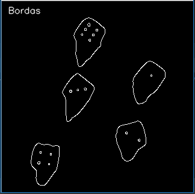

# Visao Computacional
### Aluno: Filipe Vilanova Neiva
## 1ª Questão

Imagem convertida para tons de cinza.

Aplicando o filtro blur para suavisar a imagem.

Imagem binarizada.

Detectando as bordas.

Contornando os objetos identificados.

## 2ª Questão

Local: Ambiente Escolar

Problema: A falta de praticidade em correções de provas e trabalhos com questões objetivas.

Descrição: Um sistema que utilizasse da visão computacional para detectar as respostas e corrigisse automaticamente as provas dos alunos, poderia ser de grande ajuda para a classe docente.
